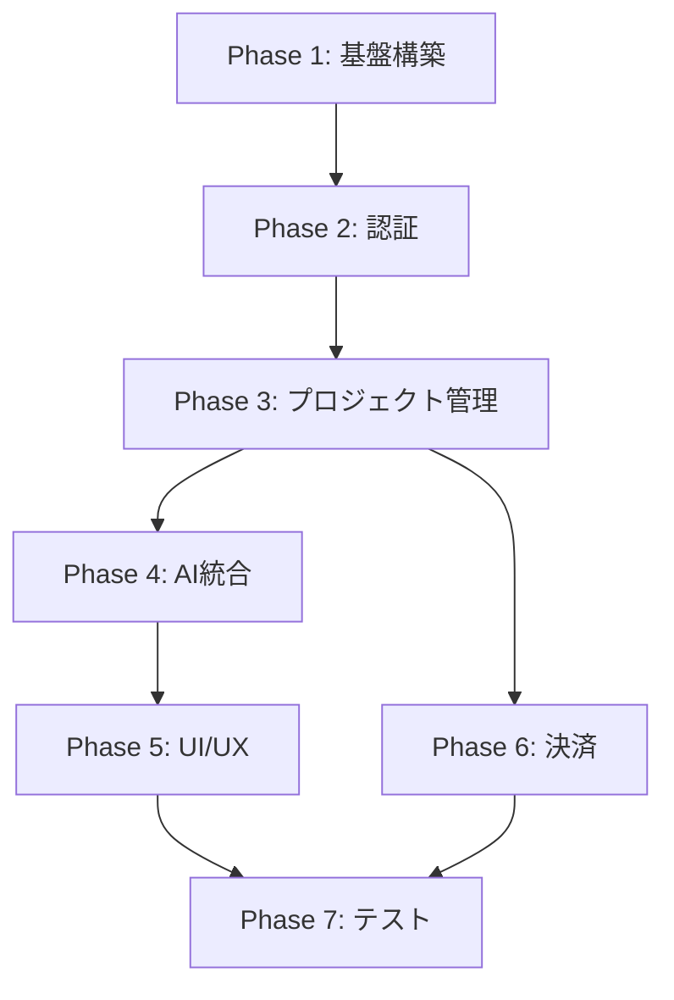

# Devin Clone MVP 作業計画

## プロジェクト概要
AIソフトウェアエンジニアDevinクローンのMVP開発（4週間計画）

## Phase 1: 基盤構築とセットアップ (3日間)

### Day 1: 開発環境構築
- [ ] 1.1 ローカル開発環境セットアップ
  - [ ] PostgreSQL/Redisインストール・設定
  - [ ] Python 3.11環境構築
  - [ ] Node.js 18+環境構築
- [ ] 1.2 プロジェクト初期化
  - [ ] リポジトリクローン
  - [ ] 環境変数設定（.env, .env.local）
  - [ ] 依存関係インストール

### Day 2: 基本インフラ構築
- [ ] 2.1 データベース設定
  - [ ] PostgreSQLスキーマ作成
  - [ ] Alembicマイグレーション実行
  - [ ] 初期データ投入
- [ ] 2.2 Redis設定
  - [ ] セッション管理設定
  - [ ] キャッシュ戦略定義

### Day 3: CI/CD基盤
- [ ] 3.1 Docker環境整備
  - [ ] docker-compose.yml最適化
  - [ ] 開発用Dockerfile作成
- [ ] 3.2 基本的なテスト環境
  - [ ] Backend: pytest設定
  - [ ] Frontend: Jest設定

## Phase 2: 認証・認可システム (4日間)

### Day 4-5: バックエンド認証
- [ ] 4.1 ユーザーモデル実装
  - [ ] SQLAlchemyモデル定義
  - [ ] Pydanticスキーマ作成
- [ ] 4.2 認証エンドポイント
  - [ ] /auth/signup実装
  - [ ] /auth/signin実装
  - [ ] /auth/refresh実装
- [ ] 4.3 JWT実装
  - [ ] トークン生成・検証
  - [ ] リフレッシュトークン管理

### Day 6-7: フロントエンド認証
- [ ] 6.1 NextAuth.js設定
  - [ ] Credentials provider設定
  - [ ] Google OAuth設定
  - [ ] セッション管理
- [ ] 6.2 認証UI実装
  - [ ] ログイン画面
  - [ ] サインアップ画面
  - [ ] パスワードリセット

## Phase 3: プロジェクト管理機能 (5日間)

### Day 8-9: プロジェクトCRUD
- [ ] 8.1 バックエンドAPI
  - [ ] プロジェクトモデル定義
  - [ ] CRUD APIエンドポイント
  - [ ] 権限チェック実装
- [ ] 8.2 フロントエンド画面
  - [ ] プロジェクト一覧
  - [ ] プロジェクト作成/編集
  - [ ] プロジェクト詳細

### Day 10-12: ファイル管理
- [ ] 10.1 ファイルストレージ
  - [ ] ローカルストレージ実装
  - [ ] ファイルアップロードAPI
- [ ] 10.2 コードエディタ統合
  - [ ] Monaco Editor設定
  - [ ] ファイルツリー実装
  - [ ] 自動保存機能

## Phase 4: AI機能統合 (6日間)

### Day 13-15: Claude API統合
- [ ] 13.1 Anthropic API設定
  - [ ] APIクライアント実装
  - [ ] レート制限管理
  - [ ] エラーハンドリング
- [ ] 13.2 プロンプトエンジニアリング
  - [ ] システムプロンプト設計
  - [ ] コンテキスト管理
  - [ ] 会話履歴管理

### Day 16-18: コード生成・実行
- [ ] 16.1 コード生成機能
  - [ ] AIレスポンス処理
  - [ ] コード抽出・フォーマット
  - [ ] 言語別処理
- [ ] 16.2 コード実行環境
  - [ ] Python実行環境
  - [ ] JavaScript実行環境
  - [ ] セキュリティサンドボックス

## Phase 5: UI/UX改善 (4日間)

### Day 19-20: インタラクティブUI
- [ ] 19.1 リアルタイム更新
  - [ ] WebSocket接続
  - [ ] ストリーミングレスポンス
  - [ ] 進捗表示
- [ ] 19.2 エラー処理
  - [ ] グローバルエラーハンドリング
  - [ ] ユーザーフィードバック
  - [ ] リトライ機能

### Day 21-22: レスポンシブデザイン
- [ ] 21.1 モバイル対応
  - [ ] レスポンシブレイアウト
  - [ ] タッチ操作対応
- [ ] 21.2 アクセシビリティ
  - [ ] キーボードナビゲーション
  - [ ] スクリーンリーダー対応

## Phase 6: 決済・課金システム (3日間)

### Day 23-25: Stripe統合
- [ ] 23.1 Stripe設定
  - [ ] 製品・価格設定
  - [ ] Webhook設定
  - [ ] 顧客管理
- [ ] 23.2 サブスクリプション
  - [ ] プラン選択UI
  - [ ] 支払い処理
  - [ ] 使用量追跡

## Phase 7: テスト・最適化 (3日間)

### Day 26-27: 総合テスト
- [ ] 26.1 機能テスト
  - [ ] E2Eテスト作成
  - [ ] 統合テスト
  - [ ] パフォーマンステスト
- [ ] 26.2 セキュリティテスト
  - [ ] 認証・認可テスト
  - [ ] SQLインジェクション対策
  - [ ] XSS対策

### Day 28: 最終調整
- [ ] 28.1 パフォーマンス最適化
  - [ ] バンドルサイズ削減
  - [ ] キャッシュ戦略
  - [ ] データベースインデックス
- [ ] 28.2 ドキュメント整備
  - [ ] APIドキュメント
  - [ ] デプロイメントガイド
  - [ ] ユーザーマニュアル

## 各フェーズの優先度と依存関係

## リスクと対策

### 技術的リスク
1. **AI API制限**: レート制限とコスト管理の実装
2. **コード実行セキュリティ**: サンドボックス環境の厳格な実装
3. **スケーラビリティ**: 初期段階からの負荷分散設計

### スケジュールリスク
1. **AI統合の複雑性**: バッファ時間の確保
2. **決済システム**: Stripeのテスト環境での十分な検証
3. **予期せぬバグ**: 各フェーズ終了時のバッファ日

## 成功指標

- **Phase 1-2**: 開発環境構築完了、基本的な認証機能動作
- **Phase 3-4**: プロジェクト管理とAI機能の基本動作
- **Phase 5-6**: ユーザビリティとビジネスモデルの確立
- **Phase 7**: 本番環境でのデプロイ可能状態

## 次のステップ
1. このプランのレビューと承認
2. 各タスクの詳細な技術仕様作成
3. チームメンバーへのタスク割り当て（該当する場合）
4. Phase 1の即時開始

## 【追記】AIによる開発引き継ぎ
- 引き継ぎ開始日：2024-06-27
- 担当者：AI（ChatGPT-4.1）

### 今後の開発方針（ドラフト）
1. 既存機能の安定化・テスト強化
2. プロジェクト管理・AI統合フェーズの着手
3. UI/UX改善のユーザーフィードバック収集と反映
4. Stripe課金・サブスクリプションの本番運用準備
5. ドキュメント・開発ガイドの充実

ご要望・優先事項があれば随時反映します。
